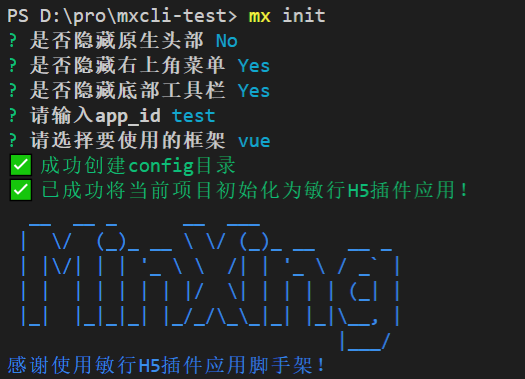
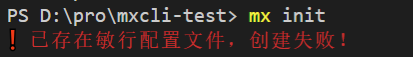
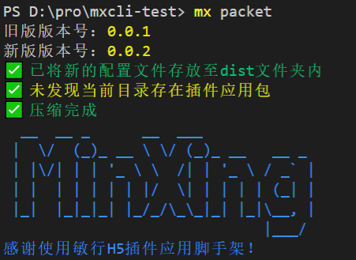
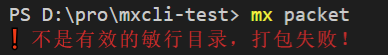
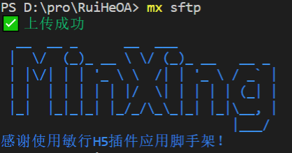
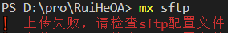

# minxing-cli: 敏行插件应用脚手架

`minxing-cli` 是快速敏行开发插件应用的命令行脚手架工具，通过简单的命令行操作即可完成初始化敏行插件应用项目、插件应用打包等功能

# 全局安装:

通过 `npm` 安装:

     npm install minxing-cli -g

这将会把 `mx` 命令安装至全局，安装后可在命令行中调用。

## 使用方式:

     mx [command]

| command | abbreviation | note |
|---|---|---|
| init | -i | 在当前文件夹初始化敏行应用 |
| packet | -p | 将当前文件夹项目增加版本号并压缩为敏行插件包 |
| sftp | -s | 将当前文件夹下build好的文件上传至服务器 |

*其他功能敬请期待*

## 功能介绍

### init / -i

初始化敏行应用，在当前项目下创建敏行的config文件夹

若当前项目下已存在完整的敏行config文件夹，则提示错误  

### packet / -p

对敏行插件应用进行打包

若当前文件夹中已存在当前应用的插件应用包，则会提示删除此压缩包                   

若当前项目不是敏行项目，会提示对应错误               

若当前项目下没有dist/www的静态目录，会提示对应错误              

### sftp / -s

若当前目录下没有/.vscode/sftp.json文件，可根据配置并创建

连接正常后，提示上传成功

连接失败，提示上传失败